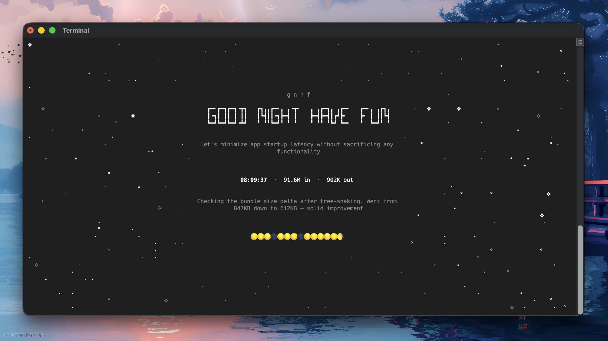

<h1 align="center">gnhf</h1>
<p align="center">
  <a href="https://www.npmjs.com/package/gnhf"
    ></a>
  <a href="https://github.com/kunchenguid/gnhf/actions/workflows/ci.yml"
    ></a>
  <a href="https://github.com/kunchenguid/gnhf/actions/workflows/release-please.yml"
    ></a>
  <a
    href="https://img.shields.io/badge/platform-macOS%20%7C%20Linux-blue?style=flat-square"
    ></a>
  <a href="https://x.com/kunchenguid"
    ></a>
  <a href="https://discord.gg/Wsy2NpnZDu"
    ></a>
</p>

<h3 align="center">Before I go to bed, I tell my agents:</h3>
<h3 align="center">good night, have fun</h3>

<p align="center">
  
</p>

gnhf is an orchestrator that keeps your agents running while you sleep — it starts a [ralph loop](https://ghuntley.com/ralph/) where each iteration makes one small, committed, documented change towards an objective.
You wake up to a branch full of clean work and a log of everything that happened.

- **Dead simple** — one command starts an autonomous loop that runs until you Ctrl+C
- **Autonomous by design** — each iteration is committed on success, rolled back on failure, with exponential backoff and auto-abort after consecutive failures
- **Agent-agnostic** — works with Claude Code or Codex out of the box

## Quick Start

```sh
$ gnhf "reduce complexity of the codebase without changing functionality"
# go to sleep
```

## Install

**npm**

```sh
npm install -g gnhf
```

**From source**

```sh
git clone https://github.com/kunchenguid/gnhf.git
cd gnhf
npm install
npm run build
npm link
```

## How It Works

```
                    ┌─────────────┐
                    │  gnhf start │
                    └──────┬──────┘
                           ▼
                ┌──────────────────────┐
                │  validate clean git  │
                │  create gnhf/ branch │
                │  write prompt.md     │
                └──────────┬───────────┘
                           ▼
              ┌────────────────────────────┐
              │  build iteration prompt    │◄──────────────┐
              │  (inject notes.md context) │               │
              └────────────┬───────────────┘               │
                           ▼                               │
              ┌────────────────────────────┐               │
              │  invoke your agent         │               │
              │  (non-interactive mode)    │               │
              └────────────┬───────────────┘               │
                           ▼                               │
                    ┌─────────────┐                        │
                    │  success?   │                        │
                    └──┬──────┬───┘                        │
                  yes  │      │  no                        │
                       ▼      ▼                            │
              ┌──────────┐  ┌───────────┐                  │
              │  commit  │  │ git reset │                  │
              │  append  │  │  --hard   │                  │
              │ notes.md │  │  backoff  │                  │
              └────┬─────┘  └─────┬─────┘                  │
                   │              │                        │
                   │   ┌──────────┘                        │
                   ▼   ▼                                   │
              ┌────────────┐    yes   ┌──────────┐         │
              │ 5 consec.  ├─────────►│  abort   │         │
              │ failures?  │          └──────────┘         │
              └─────┬──────┘                               │
                 no │                                      │
                    └──────────────────────────────────────┘
```

- **Incremental commits** — each successful iteration is a separate git commit, so you can cherry-pick or revert individual changes
- **Shared memory** — the agent reads `notes.md` (built up from prior iterations) to communicate across iterations
- **Resume support** — run `gnhf` while on an existing `gnhf/` branch to pick up where a previous run left off

## CLI Reference

| Command                 | Description                                     |
| ----------------------- | ----------------------------------------------- |
| `gnhf "<prompt>"`       | Start a new run with the given objective        |
| `gnhf`                  | Resume a run (when on an existing gnhf/ branch) |
| `echo "prompt" \| gnhf` | Pipe prompt via stdin                           |

### Flags

| Flag              | Description                        | Default  |
| ----------------- | ---------------------------------- | -------- |
| `--agent <agent>` | Agent to use (`claude` or `codex`) | `claude` |
| `--version`       | Show version                       |          |

## Configuration

Config lives at `~/.gnhf/config.yml`:

```yaml
# Agent to use by default
agent: claude

# Abort after this many consecutive failures
maxConsecutiveFailures: 5
```

CLI flags override config file values.

## Development

```sh
npm run build          # Build with tsdown
npm run dev            # Watch mode
npm test               # Run tests (vitest)
npm run lint           # ESLint
npm run format         # Prettier
```
